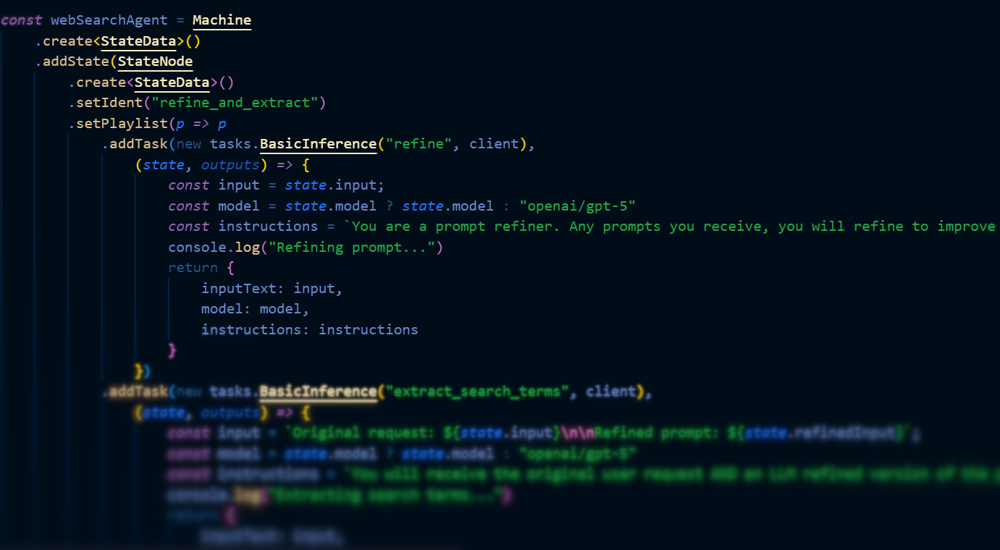

<p align="center">
  <picture>
    <source media="(prefers-color-scheme: dark)" srcset="./.github/assets/KLONK_white.png">
    <source media="(prefers-color-scheme: light)" srcset="./.github/assets/KLONK_black.png">
    
  </picture>
</p>


[klonk.dev](https://klonk.dev)


[](https://codecov.io/gh/klar-web-services/klonk)
---


*A code-first, type-safe automation engine for TypeScript.*

## Introduction

Klonk is a code-first, type-safe automation engine designed with developer experience as a top priority. It provides powerful, composable primitives to build complex workflows and state machines with world-class autocomplete and type inference. If you've ever wanted to build event-driven automations or a stateful agent, but in code, with all the benefits of TypeScript, Klonk is for you.




The two main features are **Workflows** and **Machines**.

- **Workflows**: Combine triggers with a series of tasks (a `Playlist`) to automate processes. Perfect for event-driven automation, like "when a file is added to Dropbox, parse it, and create an entry in Notion."
- **Machines**: Create finite state machines where each state has its own `Playlist` of tasks and conditional transitions to other states. Ideal for building agents, multi-step processes, or any system with complex, stateful logic.

## Installation

```bash
bun add @fkws/klonk
# or
npm i @fkws/klonk
```

## Core Concepts

At the heart of Klonk are a few key concepts that work together.

### Task

A `Task` is the smallest unit of work. It's an abstract class with two main methods you need to implement:
- `validateInput(input)`: Runtime validation of the task's input (on top of strong typing).
- `run(input)`: Executes the task's logic.

Tasks use a `Railroad` return type, which is a simple discriminated union for handling success and error states without throwing exceptions. Shoutout to Rust!

### Playlist

A `Playlist` is a sequence of `Tasks` executed in order. The magic of a `Playlist` is that each task has access to the outputs of all previous tasks, in a fully type-safe way. You build a `Playlist` by chaining `.addTask().input()` calls:

```typescript
playlist
    .addTask(new FetchTask("fetch"))
    .input((source) => ({ url: source.targetUrl }))
    .addTask(new ParseTask("parse"))
    .input((source, outputs) => ({
        // Full autocomplete! outputs.fetch?.success, outputs.fetch?.data, etc.
        html: outputs.fetch?.success ? outputs.fetch.data.body : ""
    }))
```

> **Note**: If you forget to call `.input()`, TypeScript will show an error mentioning `TaskInputRequired` - this is your hint that you need to provide the input builder!

#### Skipping Tasks

Need to conditionally skip a task? Just return `null` from the input builder:

```typescript
playlist
    .addTask(new NotifyTask("notify"))
    .input((source, outputs) => {
        // Skip notification if previous task failed
        if (!outputs.fetch?.success) {
            return null;  // Task will be skipped!
        }
        return { message: "Success!", level: "info" };
    })
```

When a task is skipped:
- Its output in the `outputs` map is `null` (not a `Railroad`)
- The playlist continues to the next task
- Subsequent tasks can check `if (outputs.notify === null)` to know it was skipped

This gives you Rust-like `Option` semantics using TypeScript's native `null` - no extra types needed!

### Trigger

A `Trigger` is what kicks off a `Workflow`. It's an event source. Klonk can be extended with triggers for anything: file system events, webhooks, new database entries, messages in a queue, etc.

### Workflow

A `Workflow` connects one or more `Triggers` to a `Playlist`. When a trigger fires an event, the workflow runs the playlist, passing the event data as the initial input. This allows you to create powerful, event-driven automations.

### Machine

A `Machine` is a finite state machine. You build it by declaring all state identifiers upfront with `.withStates<...>()`, then adding states with `.addState()`:

```typescript
Machine.create<MyStateData>()
    .withStates<"idle" | "running" | "complete">()  // Declare all states
    .addState("idle", node => node
        .setPlaylist(p => p.addTask(...).input(...))
        .addTransition({ to: "running", condition: ..., weight: 1 })  // Autocomplete!
    , { initial: true })
    .addState("running", node => node...)
    .finalize({ ident: "my-machine" });
```

Each state has:
1. A `Playlist` that runs when the machine enters that state.
2. A set of conditional `Transitions` to other states (with autocomplete!).
3. Retry rules for when a transition fails to resolve.

The `Machine` carries a mutable `stateData` object that can be read from and written to by playlists and transition conditions throughout its execution.

#### Machine run modes
- **any**: Runs until the first terminal condition occurs (leaf state, roundtrip to the initial state, or all reachable states visited).
- **leaf**: Runs until a leaf state (no transitions) is reached.
- **roundtrip**: Runs until it transitions back to the initial state.
- **infinitely**: Continues running indefinitely, sleeping between iterations (`interval` ms, default 1000). Use `stopAfter` to cap total states entered.

Notes:
- `stopAfter` counts states entered, including the initial state. For example, `stopAfter: 1` will run the initial state's playlist once and then stop; `stopAfter: 0` stops before entering the initial state.
- Retries are independent of `stopAfter`. A state can retry its transition condition (with optional delay) without affecting the `stopAfter` count until a state transition actually occurs.

## Features

- **Type-Safe & Autocompleted**: Klonk leverages TypeScript's inference to provide a world-class developer experience. The inputs and outputs of every step are strongly typed, so you'll know at compile time if your logic is sound.
- **Code-First**: Define your automations directly in TypeScript. No YAML, no drag-and-drop UIs. Just the full power of a real programming language.
- **Composable & Extensible**: The core primitives (`Task`, `Trigger`) are simple abstract classes, making it easy to create your own reusable components and integrations.
- **Flexible Execution**: `Machines` run with configurable modes via `run(state, options)`: `any`, `leaf`, `roundtrip`, or `infinitely` (with optional `interval`).

## Klonkworks: Pre-built Components

Coming soon(ish)! Klonkworks will be a large collection of pre-built Tasks, Triggers, and integrations. This will allow you to quickly assemble powerful automations that connect to a wide variety of services, often without needing to build your own components from scratch.

## Code Examples

<details>
<summary><b>Creating a Task</b></summary>

Here's how you create a custom `Task`. This task uses an AI client to perform text inference.

```typescript
import { Railroad, Task } from "@fkws/klonk";
import { OpenRouterClient } from "./common/OpenrouterClient"
import { Model } from "./common/models";

type TABasicTextInferenceInput = {
    inputText: string;
    instructions?: string;
    model: Model;
};

type TABasicTextInferenceOutput = {
    text: string;
};

// A Task is a generic class. You provide the Input, Output, and an Ident (a unique string literal for the task).
export class TABasicTextInference<IdentType extends string> extends Task<
    TABasicTextInferenceInput,  // Input Type
    TABasicTextInferenceOutput, // Output Type
    IdentType                   // Ident Type (string literal for type-safe output keys)
> {
    constructor(ident: IdentType, public client: OpenRouterClient) {
        super(ident);
        if (!this.client) {
            throw new Error("[TABasicTextInference] An IOpenRouter client instance is required.");
        }
    }

    // validateInput is for runtime validation of the data your task receives.
    async validateInput(input: TABasicTextInferenceInput): Promise<boolean> {
        if (!input.inputText || !input.model) {
            return false;
        }
        return true;
    }

    // The core logic of your task. It must return a Railroad type.
    async run(input: TABasicTextInferenceInput): Promise<Railroad<TABasicTextInferenceOutput>> {
        try {
            const result = await this.client.basicTextInference({
                inputText: input.inputText,
                instructions: input.instructions,
                model: input.model
            });
            // On success, return a success object with your data.
            return {
                success: true,
                data: { text: result }
            };
        } catch (error) {
            // On failure, return an error object.
            return {
                success: false,
                error: error instanceof Error ? error : new Error(String(error))
            };
        }
    }
}
```
</details>

<details>
<summary><b>Creating a Trigger</b></summary>

Here's an example of a custom `Trigger`. This trigger fires on a given interval and pushes the current date as its event data.

```typescript
import { Trigger } from '@fkws/klonk';

// A simple trigger that fires every `intervalMs` with the current date.
// You define the shape of the data the trigger will provide, in this case `{ now: Date }`.
export class IntervalTrigger<TIdent extends string> extends Trigger<TIdent, { now: Date }> {
    private intervalId: NodeJS.Timeout | null = null;

    constructor(ident: TIdent, private intervalMs: number) {
        super(ident); // Pass the unique identifier to the parent constructor.
    }

    // The start method is called by the Workflow to begin listening for events.
    async start(): Promise<void> {
        if (this.intervalId) return; // Prevent multiple intervals.

        this.intervalId = setInterval(() => {
            // When an event occurs, use pushEvent to add it to the internal queue.
            this.pushEvent({ now: new Date() });
        }, this.intervalMs);
    }

    // The stop method cleans up any resources, like intervals or open connections.
    async stop(): Promise<void> {
        if (this.intervalId) {
            clearInterval(this.intervalId);
            this.intervalId = null;
        }
    }
}
```
</details>

<details>
<summary><b>Building a Workflow</b></summary>

Workflows are perfect for event-driven automations. This example creates a workflow that triggers when a new invoice PDF is added to a Dropbox folder. It then parses the invoice and creates a new item in a Notion database.

Notice the fluent `.addTask(task).input(builder)` syntax - each task's input builder has access to `source` (trigger data) and `outputs` (all previous task results), with full type inference!

```typescript
import { z } from 'zod';
import { Workflow } from '@fkws/klonk';

// The following example requires tasks, integrations and a trigger.
// Soon, you will be able to import these from @fkws/klonkworks.
import { TACreateNotionDatabaseItem, TANotionGetTitlesAndIdsForDatabase, TAParsePdfAi, TADropboxDownloadFile } from '@fkws/klonkworks/tasks';
import { INotion, IOpenRouter, IDropbox } from '@fkws/klonkworks/integrations';
import { TRDropboxFileAdded } from '@fkws/klonkworks/triggers';

// Providers and clients are instantiated as usual.
const notionProvider = new INotion({ apiKey: process.env.NOTION_API_KEY! });
const openrouterProvider = new IOpenRouter({ apiKey: process.env.OPENROUTER_API_KEY! });
const dropboxProvider = new IDropbox({
    appKey: process.env.DROPBOX_APP_KEY!,
    appSecret: process.env.DROPBOX_APP_SECRET!,
    refreshToken: process.env.DROPBOX_REFRESH_KEY!
});

// Start building a workflow.
const workflow = Workflow.create()
    .addTrigger(
        new TRDropboxFileAdded("dropbox-trigger", {
            client: dropboxProvider,
            folderPath: process.env.DROPBOX_INVOICES_FOLDER_PATH ?? "",
        })
    )
    .setPlaylist(p => p
        // Get payees from Notion
        .addTask(new TANotionGetTitlesAndIdsForDatabase("get-payees", notionProvider))
        .input((source, outputs) => ({
            database_id: process.env.NOTION_PAYEES_DATABASE_ID!
        }))

        // Get expense types from Notion
        .addTask(new TANotionGetTitlesAndIdsForDatabase("get-expense-types", notionProvider))
        .input((source, outputs) => ({
            database_id: process.env.NOTION_EXPENSE_TYPES_DATABASE_ID!
        }))

        // Download the invoice PDF from Dropbox
        .addTask(new TADropboxDownloadFile("download-invoice-pdf", dropboxProvider))
        .input((source, outputs) => {
            // The `source` object contains the trigger ident for discrimination
            if (source.triggerIdent === "dropbox-trigger") {
                return { file_metadata: source.data }
            }
            throw new Error(`Trigger ${source.triggerIdent} not implemented`);
        })

        // Parse the PDF with AI
        .addTask(new TAParsePdfAi("parse-invoice", openrouterProvider))
        .input((source, outputs) => {
            // Access outputs of previous tasks - fully typed!
            // Check for null (skipped) and success
            const downloadResult = outputs['download-invoice-pdf'];
            if (!downloadResult?.success) {
                throw downloadResult?.error ?? new Error('Failed to download invoice PDF');
            }

            const payeesResult = outputs['get-payees'];
            if (!payeesResult?.success) {
                throw payeesResult?.error ?? new Error('Failed to load payees');
            }

            const expenseTypesResult = outputs['get-expense-types'];
            if (!expenseTypesResult?.success) {
                throw expenseTypesResult?.error ?? new Error('Failed to load expense types');
            }

            return {
                pdf: downloadResult.data.file,
                instructions: "Extract data from the invoice",
                schema: z.object({
                    payee: z.enum(payeesResult.data.map(p => p.id) as [string, ...string[]])
                        .describe("The payee id"),
                    total: z.number()
                        .describe("The total amount"),
                    invoice_date: z.string()
                        .regex(/^\d{4}-\d{2}-\d{2}$/)
                        .describe("Date as YYYY-MM-DD"),
                    expense_type: z.enum(expenseTypesResult.data.map(e => e.id) as [string, ...string[]])
                        .describe("The expense type id")
                })
            }
        })

        // Create the invoice entry in Notion
        .addTask(new TACreateNotionDatabaseItem("create-notion-invoice", notionProvider))
        .input((source, outputs) => {
            const invoiceResult = outputs['parse-invoice'];
            if (!invoiceResult?.success) {
                throw invoiceResult?.error ?? new Error('Failed to parse invoice');
            }
            const invoiceData = invoiceResult.data;
            return {
                database_id: process.env.NOTION_INVOICES_DATABASE_ID!,
                properties: {
                    'Name': { 'title': [{ 'text': { 'content': 'Invoice' } }] },
                    'Payee': { 'relation': [{ 'id': invoiceData.payee }] },
                    'Total': { 'number': invoiceData.total },
                    'Invoice Date': { 'date': { 'start': invoiceData.invoice_date } },
                    'Expense Type': { 'relation': [{ 'id': invoiceData.expense_type }] }
                }
            }
        })
    );

// Run the workflow
console.log('[WCreateNotionInvoiceFromFile] Starting workflow...');
workflow.start({
    callback: (source, outputs) => {
        console.log('[WCreateNotionInvoiceFromFile] Workflow completed');
        console.dir({ source, outputs }, { depth: null });
    }
});
```
</details>

<details>
<summary><b>Building a Machine</b></summary>

`Machines` are ideal for building complex, stateful agents. This example shows an AI agent that takes a user's query, refines it, performs a web search, and generates a final response.

The `Machine` manages a `StateData` object. Each `StateNode`'s `Playlist` can modify this state, and the `Transitions` between states use it to decide which state to move to next.

```typescript
import { Machine } from "@fkws/klonk"
import { OpenRouterClient } from "./tasks/common/OpenrouterClient" 
import { Model } from "./tasks/common/models"
import { TABasicTextInference } from "./tasks/TABasicTextInference"
import { TASearchOnline } from "./tasks/TASearchOnline"

type StateData = {
    input: string;
    output?: string;
    model?: Model;
    refinedInput?: string;
    searchTerm?: string;
    searchResults?: {
        results: {
            url: string;
            title: string;
            content: string;
            raw_content?: string;
            score: string;
        }[];
        query: string;
        answer?: string;
        images?: string[];
        follow_up_questions?: string[];
        response_time: string;
    };
    finalResponse?: string;
}

const client = new OpenRouterClient(process.env.OPENROUTER_API_KEY!)

const webSearchAgent = Machine
    .create<StateData>()
    // Declare all states upfront for transition autocomplete
    .withStates<"refine_and_extract" | "search_web" | "generate_response">()
    .addState("refine_and_extract", node => node
        .setPlaylist(p => p
            // Refine the user's input
            .addTask(new TABasicTextInference("refine", client))
            .input((state, outputs) => ({
                inputText: state.input,
                model: state.model ?? "openai/gpt-5.2",
                instructions: `You are a prompt refiner. Refine the prompt to improve LLM performance. 
                               Break down by Intent, Mood, and Instructions. Do NOT answer - ONLY refine.`
            }))

            // Extract search terms from refined input
            .addTask(new TABasicTextInference("extract_search_terms", client))
            .input((state, outputs) => ({
                inputText: `Original: ${state.input}\n\nRefined: ${outputs.refine?.success ? outputs.refine.data.text : state.input}`,
                model: state.model ?? "openai/gpt-5.2",
                instructions: `Extract one short web search query from the user request and refined prompt.`
            }))

            // Update state with results
            .finally((state, outputs) => {
                if (outputs.refine?.success) {
                    state.refinedInput = outputs.refine.data.text;
                }
                if (outputs.extract_search_terms?.success) {
                    state.searchTerm = outputs.extract_search_terms.data.text;
                }
            })
        )
        .retryLimit(3) // Retry up to 3 times if no transition available
        .addTransition({
            to: "search_web",  // Autocomplete works!
            condition: async (state) => !!state.searchTerm,
            weight: 2 // Higher weight = higher priority
        })
        .addTransition({
            to: "generate_response",  // Autocomplete works!
            condition: async () => true, // Fallback
            weight: 1
        })
    , { initial: true })

    .addState("search_web", node => node
        .setPlaylist(p => p
            .addTask(new TASearchOnline("search"))
            .input((state, outputs) => ({
                query: state.searchTerm!
            }))
            .finally((state, outputs) => {
                if (outputs.search?.success) {
                    state.searchResults = outputs.search.data;
                }
            })
        )
        .addTransition({
            to: "generate_response",
            condition: async () => true,
            weight: 1
        })
    )

    .addState("generate_response", node => node
        .setPlaylist(p => p
            .addTask(new TABasicTextInference("generate_response", client))
            .input((state, outputs) => ({
                inputText: state.input,
                model: state.model ?? "openai/gpt-5.2",
                instructions: `You received a user request and refined prompt. 
                               ${state.searchResults ? 'Search results are also available.' : ''}
                               Write a professional response.`
            }))
            .finally((state, outputs) => {
                state.finalResponse = outputs.generate_response?.success
                    ? outputs.generate_response.data.text
                    : "Sorry, an error occurred: " + (outputs.generate_response?.error ?? "unknown");
            })
        )
    )
    .addLogger(pino()) // Optional: Add structured logging (pino recommended)
    .finalize({ ident: "web-search-agent" });

// ------------- EXECUTION -------------

const state: StateData = {
    input: "How do I update AMD graphic driver?",
    model: "openai/gpt-5.2-mini"
};

// Run until it completes a roundtrip to the initial state
const finalState = await webSearchAgent.run(state, { mode: 'roundtrip' });

console.log(finalState.finalResponse);
// The original state object is also mutated:
console.log(state.finalResponse);
```
</details>

## Type System

Klonk's type system is designed to be minimal yet powerful. Here's what makes it tick:

### Core Types

| Type | Parameters | Purpose |
|------|------------|---------|
| `Task<Input, Output, Ident>` | Input shape, output shape, string literal ident | Base class for all tasks |
| `Railroad<Output>` | Success data type | Discriminated union for success/error results |
| `Playlist<AllOutputs, Source>` | Accumulated output map, source data type | Ordered task sequence with typed chaining |
| `Trigger<Ident, Data>` | String literal ident, event payload type | Event source for workflows |
| `Workflow<Events>` | Union of trigger event types | Connects triggers to playlists |
| `Machine<StateData, AllStateIdents>` | Mutable state shape, union of state idents | Finite state machine with typed transitions |
| `StateNode<StateData, Ident, AllStateIdents>` | State shape, this node's ident, all valid transition targets | Individual state with playlist and transitions |

### How Output Chaining Works

When you add a task to a playlist, Klonk extends the output type:

```typescript
// Start with empty outputs
Playlist<{}, Source>
    .addTask(new FetchTask("fetch")).input(...)
// Now outputs include: { fetch: Railroad<FetchOutput> | null }
Playlist<{ fetch: Railroad<FetchOutput> | null }, Source>
    .addTask(new ParseTask("parse")).input(...)  
// Now outputs include both: { fetch: ..., parse: Railroad<ParseOutput> | null }
```

The `| null` accounts for the possibility that a task was skipped (when its input builder returns `null`). This is why you'll use optional chaining like `outputs.fetch?.success` - TypeScript knows the output could be `null` if the task was skipped!

This maps cleanly to Rust's types:
| Rust | Klonk (TypeScript) |
|------|-------------------|
| `Option<T>` | `T \| null` |
| `Result<T, E>` | `Railroad<T>` |
| `Option<Result<T, E>>` | `Railroad<T> \| null` |
